# 2020-Mortgage-Forbearance-Analysis

This is the Jupyter notebook behind TapCap's Blog post on who needed Mortgage Forbearance:

https://blog.tapcap.co/who-needed-mortgage-forbearance

----

In mid March, in an effort to curb the (projected) impending wave of defaults, the Agencies announced [mortgage forbearance programs](https://hello.tapcap.co/blog#page-block-0euyltqt2z28). These programs would allow borrowers to, at zero cost, defer their mortgage payments for up to 3 months in the event that their debt service coverage fell below 1.0 (monthly current net income is below monthly loan payment). 

We’re now in July - [NMHC’s rent tracker](https://www.nmhc.org/research-insight/nmhc-rent-payment-tracker/) has remained in the mid 90’s%, multifamily seems to be doing okay. However I was curious, did anyone actually require mortgage forbearance? If so, who and what happened?

As of June 30th,

---

| $11.6B+ | ~1,450 | ~1.5% |
|:--------:|:-------:|:--------:|
| Aggregate UPB at Forbearance | Number of Loans in Forbearance   | Pct of Agency UPB outstanding   |
---

For perspective, the agencies carry a combined total of approximately $740Bn in principal balance over ~68k loans. 

[According to the MBA](https://www.mba.org/news-research-and-resources/research-and-economics/commercial/-multifamily-research/commercial/multifamily-mortgage-delinquency-rates), Over the majority of the last decade, the agencies have both kept delinquency rates around 5-20bps, so while a 1.5% rate wouldn’t turn any heads in the CMBS market, it is worth taking a closer look at what happened with these 1,450 loans. 

*NOTE: If you would like to know more about the data we collected or have any questions regarding the methodology, please reach out to [hello@tapcap.co](mailto:hello@tapcap.co).*

----

#### Location of Properties

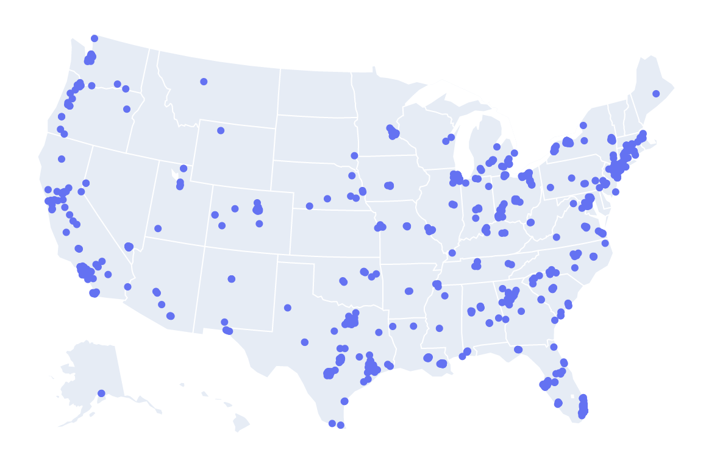

Nothing odd here. 

Clusters seem to align with larger MSA’s. This might dispel the assumption that smaller markets were hit harder - top markets were certainly impacted as well. Actually, I think the better way to phrase it is that majority of properties have so far weathered the storm well, across the nation, and that the reasons for properties requiring forbearance had more to do with the asset than the environment. 

But let's continue looking.

|By State|   |By City          |   |
|:-------|:--|:----            |--:|
|1.  NY  |342|1.  Manhattan    |133|
|2.  CA  |177|2.  Brooklyn     |92 |
|3.  TX  |125|3.  Los Angeles  |68 |
|4.  FL  |95 |4.  Chicago      |54 |
|5.  IL  |71 |5.  Houston      |28 |
|6.  NJ  |45 |6.  Yonkers      |21 |
|7.  OH  |41 |7.  San Antonio  |20 |
|8.  GA  |34 |8.  Bronx        |18 |
|9.  CT  |32 |9.  Tampa        |12 |
|10. LA  |27 |10. Seattle      |12 |
|11. WA  |24 |11. Las Vegas    |12 |
|12. OR  |22 |12. Miami        |12 |
|13. SC  |22 |13. East Orange  |11 |
|14. CO  |21 |14. Baltimore    |11 |
|15. MD  |20 |15. Philadelphia |10 |

----

#### Property Characteristics

**Unit Count**

    

        The graph shows a pretty skewed unit count. Clearly a large portion of the properties requiring forbearance are on the smaller side. 48% of the properties had 50 units or less. Now we’re on to something right?
    

    

        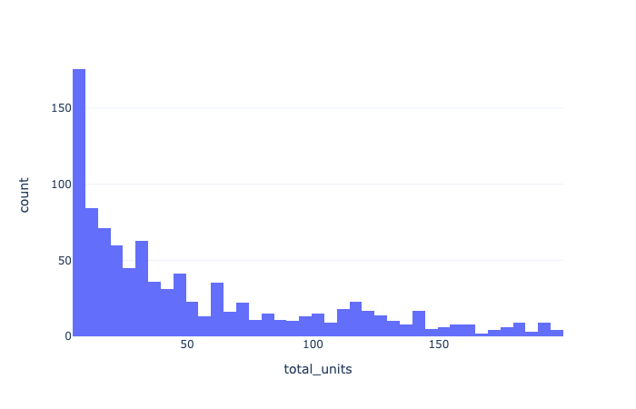
    

    

        Then again, the vast majority of multifamily properties in the U.S. are simply smaller. There are more 5 unit buildings than 50, and more 50 unit buildings than 500. Let’s overlay all properties, regardless of forbearance status, and try to determine if smaller properties were hit harder disproportionately.
    

    

        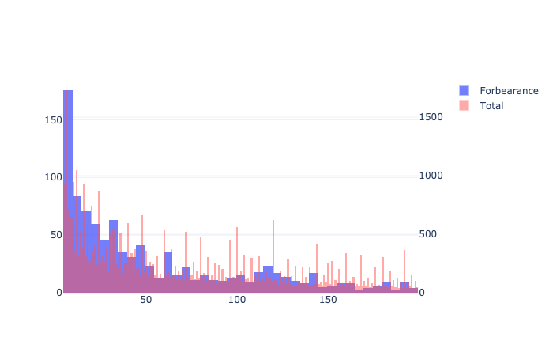
    

    

        The two traces appear to be pretty similar. However if we unskew the points and look at the log(units), the story becomes more clear -  
        **smaller properties were hit harder.**
    

    

        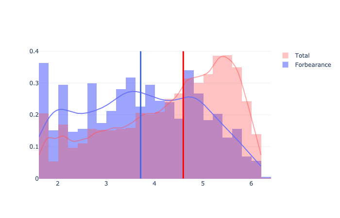
    

----
**Year Built**

    

        Older properties were hit harder - go figure. 
        We’ll see later on that several of these properties were hit with a significant capital expenditure. Many of the properties that required mortgage forbearance had significant R&M increases - and property age + size could definitely be a contributor.
    

    

        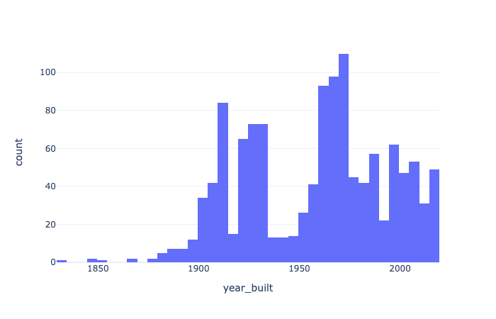
    

----
**Condition**

    

        Also not too much of a surprise here.   
        Though property condition is somewhat subjective, workforce housing seems to have been hit harder than luxury.   
        It should be noted that most properties in the Agencies' portfolios are B & C class, so it would make sense that they would make up a larger percentage, all else being equal. However the amount of properties that are B&C vs A is disproportionate to the entire normal portfolio mix.   
        I wonder how well this graph will stand up considering that luxury rentals are [now taking a really hard hit](https://www.wsj.com/articles/coronavirus-is-sending-luxury-rental-markets-on-a-rollercoaster-ride-11591287680). “A” class properties requiring forbearance will likely rise over the coming months.
    

    

        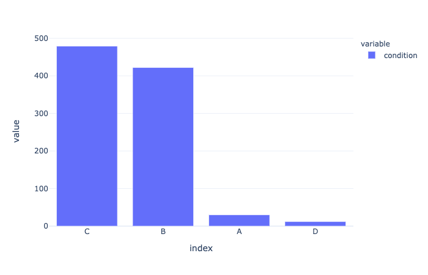
    

----
#### Loan Characteristics

**Loan Amount**

    

        Most loans were smaller. No surprise since as we discussed above, most properties were smaller. There is a longer tail here (highest single loan was > $90M, and then a portfolio loan of over $500M). But that large tower in the graph here is right between $1M-$2M.
    

    

        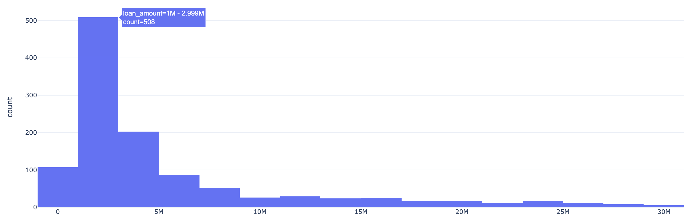
    

----
**Interest Rate**

    

        Rates seem to have a pretty high variance, centered around 4.4% Rate.    
        It should be noted that there are a handful of supplemental loans included and those carry a higher rate (which is topic for another discussion - it isn't necessarily because of the higher risk).  
        As we'll see below, one reason for the high variance is because the loans represented were issued largely over a 4 year period, and rates have fluctuated between low 3's and 5's during that time. Otherwise, these rates seem inline with loans that did not require forbearance, so nothing out of the ordinary here.
    

    

        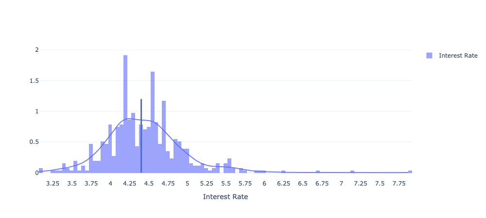
    

----
**Loan Seasoning**

    

        With a notable exception of the cluster around year 15, which turns out to be a portfolio 
        loan of smaller properties, majority of loans are somewhat recent, between 1-4 years old.   
        This isn't surprising since the Agency SBL product that most of these loans fall under 
        was only released late 2014. Even then, production has only increased since that release, 
        so seeing that majority of the loans requiring forbearance are only 2-4 years old is really not so surprising.
    

    

        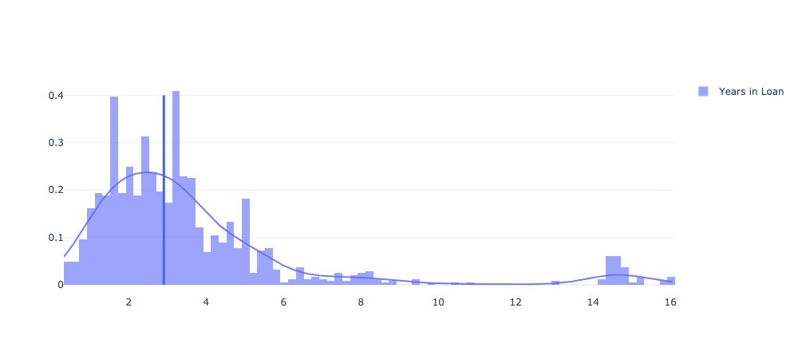
    

----
**Leverage**

    

        That there are high levered loans in here is no surprise. Rather, it is surprising how many 
        lower levered loans are in the mix.   
        The items all the way on the left (<35%) are supplementals, so the overall debt stack was high. 
        However, there are quite a handful of single, mid tier loans on here.   
        We'll see later on that quite a few of the smaller properties did have a pretty significant 
        decrease in cash, which may explain why even tier 3 loans were impacted. 
    

    

        
    

----
**Lender**

    

        Just Kidding!  
        TapCap's legal counsel has advised us that it would be best not to publish this metric.  
        I'll say this much - the results largely relate to the lenders pushing the most SBL volume. 
        There isn't any clear indication that one lender has a larger percentage relative to their 
        production amounts, so this metric wouldn't really be meaningful either.   
        and if you must, please use the following email address for C&D letters: [I.Hate.Transparency@tapcap.co](https://www.youtube.com/watch?v=oHg5SJYRHA0)
    

    

        
    

----
#### Operational Characteristics

**Occupancy**

    

        While most properties reported being above 95% occupancy, 25% of the properties were below 90% occupancy.  
        *Note, this is physical occupancy, not economic occupancy which instead of actual tenants, looks 
        at how collections loss and concessions over gross potential rent.*   
        This is significantly lower than the Agency portfolio where 88% of 
        properties are at or above 90% occupancy.   
        **Lower occupancy was certainly a factor for many of these properties.**
    

    

        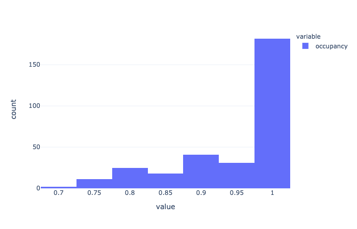
    

  

    

        Was this occupancy trend something recent or were there already warning signs?  
        Here we look at the trailing 3 year avg occupancy.  
        As shown here - most properties kept a stable Occupancy.  
        It’s hard to see here, but that central bucket represents 196 properties that had stable 
        occupancy ± 2%. The bucket to the left of it represents 42 properties with a -3% to -7% 
        decline in occupancy. Going further we are at a -10% drop.  
        This confirms the above occupancy analysis - it seems that 
        **several of these properties were already on a downward trend.**
    

    

        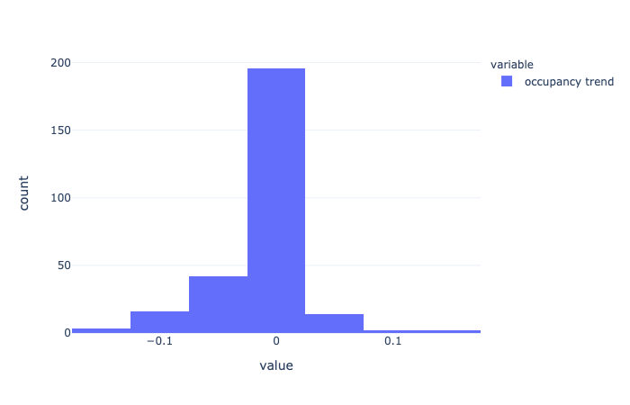
    

----
**Expense Trend**

    

        How were expenses? Was it a recent shock or were there warning signs there too?  
        Let's look at the Trailing 3 year annual Expense amounts.   
        *It should be noted that we were only able to look at 283 (~20%) of the loans for this analysis.*  
        It’s expected for property expenses to rise ~2%-3% each year. However here we see that quite a few properties were hit with a significant increase in expenses. This doesn’t seem typical and might be our clue into what happened to many of these properties. 
    

    

        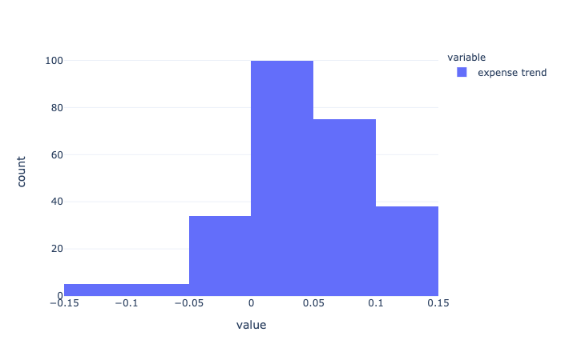
    

----

We looked at 8 common expense categories,

- Admin
- Taxes
- Insurance
- Utilities
- Management Fee
- Marketing
- Payroll
- R&M

For each expense line item, we looked at the 3 year trend, recent anomalies, as well as overall impact on the total expense amount. Instead of diving into each item, we’re going to cut straight to the most interesting ones:

**Repairs & Maintenance**

Roughly 40% of the loans we looked at had a significant increase in R&M before requesting forbearance. Of the one’s hit hard by R&M, the median increase was 18% compared to the previous year. For these properties, R&M represented between 20%-25% of the total expense amount, so this increase alone may have been enough to push DSCRs close to or below 1.

**Taxes**

~30% of the properties had a large increase in taxes (>10%) compared to prior years. We don’t have information on what triggered the change, whether it was a reassessment or the expiration of some sort of abatement, but we can see that the reported tax number rose significantly for a large number of these properties. Taxes contributed ~25% of the TOE on average.

**Utilities (???)**

This is the oddest one. ~20% of the properties had a significant increase in utility expense. We’ll have to dig further into the analysis to understand this trend, though I wonder how much of it is connected to the subsequent increase in R&M. I’d welcome any thoughts that you have as to why the utility expense would jump. Tenant reimbursements fall? Damage to pipes?

----

#### Conclusion

Though we try to make sense of what happened through all of the above, it should be noted that we are making inferences about the causes, we don’t actually know what happened. Furthermore, it’s a small slice of the total population of Agency financed properties and we’re specifically focusing on records that are anomalies. 

The data used is data reported by loan servicers. We did our best to clean the information, though there were certainly some data reporting “anomalies” that we had to weed out. I would absolutely welcome additional collaboration on this analysis.

Another point is that these are mostly smaller properties, which happen to be more vulnerable to large changes. Larger properties benefit from scale and can usually weather fluctuations - smaller properties are just more at risk. For example, maybe the utility finding above is interesting, or maybe it’s just an odd coincidence that may statistically occur when you’re slicing the data into smaller segments of properties with greater variability. 

There isn’t a clear smoking gun - but our best estimate is that you had **a group of properties, mostly smaller, who were already facing downward occupancy trends, that were hit by a big ticket expense item - be it a R&M/Capex item or an increased tax bill**.

*If any group is interested in the data or the list of properties, please be in touch: [hello@tapcap.co](mailto:hello@tapcap.co)*